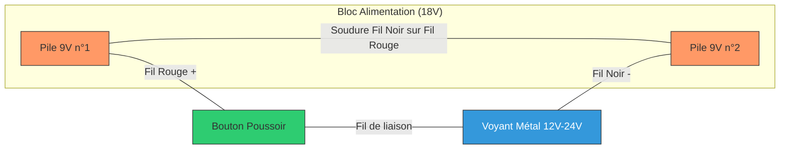

# 🚀 Projet : Replique Pistolet Laser (18V)

Ce projet permet de fabriquer un système d'éclairage puissant pour une réplique de pistolet laser (type Star Fox) en utilisant des voyants LED industriels en métal et une double alimentation.

## 📦 Matériel et Composants

* **Voyants LED :** 1x (ou plus) RUNCCI-YUN 12mm Métal (Plage 12V-24V).
* **Énergie :** 2x Piles 9V classiques (format 6LR61).
* **Supports :** 2x Clips ou boîtiers pour piles 9V.
* **Contrôle :** 1x Bouton poussoir momentané (la lumière s'éteint quand on relâche).
* **Câblage :** Fil électrique souple, pistolet à colle (pour l'isolation et la fixation), fer à souder et étain.

## 📐 Schéma de Câblage (Mermaid)

## 🛠 Instructions de Montage

### 1. Préparation du bloc 18V (Série)

1. Prenez les deux clips de piles 9V.
2. Soudez le **fil noir** du premier clip au **fil rouge** du deuxième clip.
3. Isolez cette soudure avec une généreuse goutte de colle chaude ou du ruban isolant.

* *Il vous reste maintenant un fil rouge (le +) et un fil noir (le -) libres.*

### 2. Installation du Bouton (Détente)

1. Soudez le **fil rouge libre** venant de vos piles sur l'une des deux bornes du bouton poussoir.
2. Soudez un nouveau fil (fil de liaison) sur la deuxième borne du bouton.

### 3. Branchement du Voyant LED

1. Reliez le fil de liaison venant du bouton au **fil rouge** du voyant LED.
2. Reliez le **fil noir** du voyant LED au **fil noir libre** venant de vos piles.

### 4. Finitions et Isolation

1. **Test :** Insérez les piles et appuyez sur le bouton. Si cela ne s'allume pas, vérifiez le sens de branchement des fils de la LED (Polarité).
2. **Isolation :** Utilisez votre pistolet à colle pour recouvrir toutes les parties métalliques dénudées (bornes du bouton, soudures). Cela évitera les courts-circuits lors de vos mouvements.
3. **Fixation :** Fixez les piles à l'intérieur de la crosse avec du velcro ou de la colle chaude.

## 💡 Astuces

* **Perçage :** Le voyant nécessite un trou de **12mm**. Percez doucement dans le plastique pour éviter les fissures.
* **Gâchette :** Placez le bouton de manière à ce que la gâchette mécanique de votre réplique vienne physiquement appuyer dessus.
* **Entretien :** Retirez les piles si vous ne portez pas le cosplay pendant plusieurs mois pour éviter qu'elles ne coulent à l'intérieur.